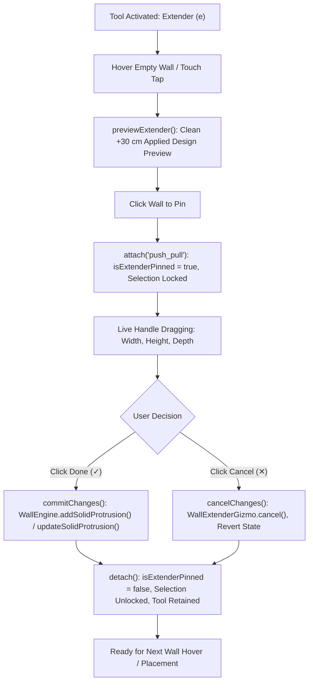

# Wall Extender & Multi-Protrusion Expert Guidelines

This skill defines the architectural, geometric, and interaction standards for the **Wall Extender Tool** (`COMMON_TOOLS.EXTENDER` / `mode: 'push_pull'`) and exterior solid wall protrusions (`solid_protrusion`) in the 3D planner engine.

---

## 1. Architectural Architecture & Core Invariants

### A. The Wall Extender Role
The Extender tool allows users to pull sections of a wall outward to create architectural solid protrusions (such as exterior bump-outs, bay facades, architectural offsets, pilasters, or structural columns) or push inward to create architectural niches.

### B. Core Architectural Rules
1. **Monolithic Wall Geometry**:
   - A protrusion is structurally part of the host wall.
   - It is NOT a hollow room, separate wall entity, or detached furniture item.
   - The wall body behind the bump-out remains 100% solid (`hasHole = false`).
2. **Multiple Protrusions on Single Walls**:
   - A single host wall can host **multiple independent protrusions** at different locations along its length ($t \in [0, 1]$), with distinct widths, heights, elevations, and depths.
   - Adding a new protrusion MUST NEVER overwrite, shift, or inherit the depth of an existing protrusion on the same wall.
3. **Single Source of Truth (`WallEngine`)**:
   - Adding a new protrusion routes strictly through `WallEngine.addSolidProtrusion(wall, options, shouldSync, planner)`.
   - Editing an existing protrusion routes strictly through `WallEngine.updateSolidProtrusion(wall, targetProtrusion, updates, shouldSync, planner)`.
   - Removing an existing protrusion routes strictly through `WallEngine.removeSolidProtrusion(wall, targetProtrusion, shouldSync, planner)`.

---

## 2. 3D Direct Applied Design Highlighter

### A. Zero Duplicate/Blank Highlights
- When `COMMON_TOOLS.EXTENDER` is active, the generic whole-wall blue selection highlight (`this.setHighlight(..., 0x93c5fd)`) MUST be suppressed in `InteractionSystem._onPointerMove`.
- The live highlighter IS the actual **applied design** rendered by `WallExtenderGizmo`:
  - 3D solid protrusion block (`previewMesh`)
  - Glowing edges (`previewEdges`)
  - Center 4-way arrow disc ✥ (`handleFront` / `handleBack`)
  - 4 corner circular discs & rings (`cornerBL`, `cornerBR`, `cornerTL`, `cornerTR`)
  - Top & bottom height handles (`topHeightHandle`, `bottomHeightHandle`)
  - Left & right width boundary handles (`startWidthHandle`, `endWidthHandle`)
  - 3D depth leader line (`depthLeaderLine`) and floating dimension badge (`badgeDepth`)

### B. Camera Line-of-Sight Facing Detection
In `previewExtender(wallMesh, hitPoint)`, always compute facing using the camera vector relative to the wall face:
```javascript
const dx = p2.x - p1.x;
const dy = p2.y - p1.y;
const wallMidX = p1.x + (tStart + tEnd) * 0.5 * dx;
const wallMidZ = p1.y + (tStart + tEnd) * 0.5 * dy;
const camPos = this.ctx.camera.position;
const nx = -dy / wallLen;
const ny = dx / wallLen;
const dot = (camPos.x - wallMidX) * nx + (camPos.z - wallMidZ) * ny;
const facing = dot >= 0 ? 1 : -1;
```
- `facing = 1` (+Z, front face).
- `facing = -1` (-Z, back face).

### C. Zero-Flicker Raycast Neutrality
During hover preview (`!suite.isOperationActive()`), clicking the previewed handles must NOT swallow pointer events.
In `WallExtenderGizmo._onPointerDown(e)`:
```javascript
const suite = this.ctx?.interactions?.wallInteractiveSuite;
if (suite && !suite.isOperationActive()) {
    return; // Allow click to pass through to InteractionSystem for placement/pinning
}
```

---

## 3. Depth Isolation & Accurate Hit-Testing

### A. Eliminating Blind Protrusion Capture
`WallExtenderGizmo.attach(object, targetProtrusion = undefined)` must explicitly support `targetProtrusion`:
```javascript
if (targetProtrusion !== undefined) {
    this.existingProtrusion = targetProtrusion;
} else {
    this.existingProtrusion = object.userData?.widget 
        || (object.userData?.isProtrusion ? (object.userData.entity?.type === 'solid_protrusion' ? object.userData.entity : (object.userData.widget || null)) : null)
        || (wall?.attachedWidgets?.find(w => (w.type === 'solid_protrusion' || w.configId === 'solid_protrusion') && (w.depth || w.width)));
}
```
- When hovering or clicking empty wall space, pass `targetProtrusion = null`. This prevents the gizmo from latching onto prior protrusions via `find(...)`.
- Previews on clean wall space start at clean $+30\text{ cm}$ default depth, NOT the $+108\text{ cm}$ depth of another protrusion on the wall.

### B. Hit-Testing: Editing vs. New Placement
In `previewExtender(wallMesh, hitPoint)` and `attach(wallMesh, mode, hitPoint)`:
1. Compute projected length fraction `projT` along the wall baseline:
   ```javascript
   const projT = ((hitPoint.x - p1.x) * dx + (hitPoint.z - p1.y) * dy) / (wallLen * wallLen);
   ```
2. Check if `projT` overlaps an existing `solid_protrusion` in `wall.attachedWidgets`:
   ```javascript
   let matchedProtrusion = null;
   if (wallMesh.userData?.isProtrusion && (wallMesh.userData.widget || wallMesh.userData.entity)) {
       matchedProtrusion = wallMesh.userData.widget || wallMesh.userData.entity;
   } else if (wall.attachedWidgets && wall.attachedWidgets.length > 0) {
       matchedProtrusion = wall.attachedWidgets.find(w => {
           if (w.type !== 'solid_protrusion' && w.configId !== 'solid_protrusion') return false;
           const pW = w.width || 40;
           const pT = w.t !== undefined ? w.t : 0.5;
           const halfT = (pW / 2) / wallLen;
           const t1 = Math.max(0, pT - halfT);
           const t2 = Math.min(1, pT + halfT);
           return projT >= (t1 - 0.02) && projT <= (t2 + 0.02);
       }) || null;
   }
   ```
3. **If `matchedProtrusion` exists**:
   - Attach with `targetProtrusion = matchedProtrusion`.
   - Load its existing depth (`depth = matchedProtrusion.depth`).
   - Badge text: `↔️ Click to Edit Extension (+${depth} cm · Width: ${width} cm)`.
4. **If hovering empty wall space (`matchedProtrusion === null`)**:
   - Attach with `targetProtrusion = null`.
   - Set clean default depth: `currentExtrudeDepth = 30`.
   - Badge text: `↔️ Click to Place Extension (+30 cm · Width: ${width} cm)`.

---

## 4. Dedicated 3D Interactable Hitboxes (`wall.renderer3d.js`)

### A. Protrusion Hitbox Generation
In `wall.renderer3d.js:buildWallGroup()`, create an invisible interactable hitbox mesh for every solid protrusion:
```javascript
if (protrusions.length > 0) {
    protrusions.forEach((prot) => {
        const protW = prot.width || 40;
        const protT = prot.t !== undefined ? prot.t : 0.5;
        const xCenter = protT * length;
        const x1 = Math.max(0, Math.min(length, xCenter - protW / 2));
        const x2 = Math.max(0, Math.min(length, xCenter + protW / 2));
        const actualW = x2 - x1;
        if (actualW < 0.1) return;

        const protH = prot.height || maxH;
        const protElev = prot.elevation || 0;
        const protDepth = Math.abs(Number(prot.depth) || 10);
        const isBack = (prot.facing === -1 || prot.facing === 'back' || prot.side === 'right');
        const facing = isBack ? -1 : 1;
        const zCenter = facing === 1 ? (t / 2 + protDepth / 2) : (-t / 2 - protDepth / 2);

        const protHitGeo = new THREE.BoxGeometry(actualW, protH, protDepth);
        protHitGeo.translate((x1 + x2) / 2, protElev + protH / 2, zCenter);
        shearGeo(protHitGeo);

        const protHitMesh = new THREE.Mesh(protHitGeo, new THREE.MeshBasicMaterial({ visible: false, side: THREE.DoubleSide }));
        protHitMesh.userData = {
            isProtrusion: true,
            isWidget: true,
            entity: prot,
            widget: prot,
            parentWall: w,
            wall: w
        };
        extraHitboxes.push(protHitMesh);
    });
}
```

### B. Material Triangle Classification for All Protrusions
When mapping 3D vertex groups to materials in `buildWallGroup`, NEVER test only `protrusions[0]`. Iterate over all protrusions:
```javascript
let isProtFace = false;
for (let pi = 0; pi < protrusions.length; pi++) {
    const p = protrusions[pi];
    const pW = p.width || 40;
    const pT = p.t !== undefined ? p.t : 0.5;
    const xCenter = pT * length;
    const x1 = Math.max(0, xCenter - pW / 2);
    const x2 = Math.min(length, xCenter + pW / 2);
    const facing = p.facing || 1;
    if (midX >= x1 - 0.05 && midX <= x2 + 0.05) {
        if (facing === 1 && midZ >= t / 2 - 0.1) {
            isProtFace = true;
            break;
        } else if (facing === -1 && midZ <= -t / 2 + 0.1) {
            isProtFace = true;
            break;
        }
    }
}
```

---

## 5. Direct Selection & Re-Editing Workflow (`InteractionSystem.js`)

### A. Protrusion Traversal in Pointer Move
In `InteractionSystem._onPointerMove`:
```javascript
let wallMesh = hitMesh;
while (wallMesh && !wallMesh.userData?.isWallSide && !wallMesh.userData?.isWallMesh && !wallMesh.userData?.isWall && !wallMesh.userData?.isProtrusion && wallMesh.parent) {
    wallMesh = wallMesh.parent;
}
const isBaseWall = wallMesh && (wallMesh.userData?.isWallSide || wallMesh.userData?.isWallMesh || wallMesh.userData?.isWall || wallMesh.userData?.isProtrusion);
```

### B. Direct Selection Mode Routing
In `InteractionSystem.selectObject`, when clicking a protrusion in Select mode (`COMMON_TOOLS.SELECT` or when `!isWallSuiteTool`):
```javascript
if (object.userData?.isProtrusion && this.wallInteractiveSuite) {
    this.wallInteractiveSuite.attach(object, 'push_pull', hitInfo?.point);
} else if (isBaseWall && this.wallInteractiveSuite) {
    if (isWallSuiteTool) {
        this.wallInteractiveSuite.attach(object, currentCommonTool, hitInfo?.point);
    } else {
        this.wallInteractiveSuite.attach(object, 'menu');
    }
}
```
This ensures clicking any protrusion in the 3D scene immediately opens the Extender handles, current depth dimension, and `[Done ✓] [Cancel ✕]` HUD for fast adjustments.

---

## 6. 2-Step Pinned Editing & HUD Confirmation Lifecycle



### Required Lifecycle Behaviors
1. **Selection Lockout**: While pinned (`isOperationActive() === true`), clicks in the 3D viewport do NOT switch walls or lose selection.
2. **Done (✓)** commits changes in place and resets `isExtenderPinned = false`.
3. **Cancel (✕)** restores initial state via `WallExtenderGizmo.cancel()` without creating unwanted geometry.
4. **Tool Persistence**: After Done or Cancel, `activeTool` remains `push_pull`. The user can immediately hover over another wall and place another extension.
5. **State Reset**: `WallInteractiveSuite.detach()` MUST reset `this.extenderTargetProtrusion = null` to prevent state leakage.

---

---

## 7. Geometric Validation & Red Warning Highlights on Small/Angled Walls

### A. Architectural Rules & Thresholds
Wall pull features (Extender solid bump-outs, Bay Windows, Recessed Niches) require adequate physical wall length and breadth to prevent corner clipping, inverted returns, and geometric collisions:
1. **Minimum Host Wall Length (`MIN_WALL_LEN = 40 cm`)**:
   - Host walls shorter than 40 cm cannot accommodate returns, depth offsets, and miters.
   - Violation message: `🚫 Wall Too Short (${wallLen} cm · Min 40 cm)`.
2. **Minimum Feature Span (`MIN_SPAN = 30 cm`)**:
   - Calculated feature width $\text{spanCm} = \text{wallLen} \times |t_{\text{end}} - t_{\text{start}}|$ must be at least $30\text{ cm}$.
   - Prevents narrow slivers (e.g., 13 cm bays) that distort angled wall corners and collide return geometry.
   - Violation message: `🚫 Space Too Short (${spanCm} cm · Min 30 cm)`.
3. **Connected Corner Clearance (`MIN_CORNER_CLEARANCE = 25 cm`)**:
   - When adjoining room walls meet at `startAnchor` or `endAnchor` (e.g. angled, L, or T-corners), the feature cannot be placed closer than $25\text{ cm}$ to that corner.
   - Protects the physical corner miter boundary from colliding with extrusion cuts.
   - Violation message: `🚫 Too Close to Connected Corner (${dist} cm · Min 25 cm)`.
4. **Wing Clearance for Wall Cuts (`MIN_WING = 20 cm`)**:
   - In `extrude_recess`, wall wings (`wStart` and `wEnd`) cannot be slivers $< 20\text{ cm}$.
   - Prevents microscopic wall fragments from collapsing into anchors or breaking corner miters.
   - Violation message: `🚫 Too Close to Corner (${dist} cm · Min 20 cm)`.
5. **Anchor Preservation Invariant (`WallTopologyEngine.extrudeWallSegment`)**:
   - When an extrusion begins within $25\text{ cm}$ of `p1` or $t_{\text{start}} \le 0.05$, `wReturn1` anchors directly to `anc1` (`wall.startAnchor`).
   - When an extrusion ends within $25\text{ cm}$ of `p2` or $t_{\text{end}} \ge 0.95$, `wReturn2` anchors directly to `anc2` (`wall.endAnchor`).
   - `wStart` and `wEnd` 0-length loops (`startAnchor === endAnchor`) are strictly prevented. Adjoining walls are guaranteed to remain 100% connected.

### B. High-Fidelity 3D Red Visual Feedback (`0xef4444`)
When validation fails (`isValidPlacement === false`):
1. **Extender Solid Protrusion Preview**:
   - `previewMesh.material.color` switches to Crimson Red (`0xef4444`, opacity: 0.50).
   - `previewEdgesMat.color` switches to Crimson Red (`0xef4444`).
   - Manipulation handles and depth leader line are suppressed to communicate that pulling is disallowed.
2. **Bay/Niche Neutral Ghost Preview**:
   - `matNeutralGhost` switches to `matInvalidGhost` (`0xef4444`, opacity: 0.45).
   - Outline switches to `matInvalidOutline` (`0xef4444`, linewidth: 2.5).
   - Bi-directional depth handles (`extrudeHandle`, `extrudeStartHandle`, `extrudeEndHandle`) are hidden.
3. **HUD Warning Pill Badge**:
   - Background changes to red warning gradient: `linear-gradient(135deg, rgba(239, 68, 68, 0.95), rgba(185, 28, 28, 0.95))`.
   - Border: `rgba(254, 202, 202, 0.8)`. Box shadow: `0 8px 20px rgba(239, 68, 68, 0.35)`.
   - Viewport cursor: `not-allowed`.
4. **Placement Rejection**:
   - Clicking an invalid wall segment blocks pinning (`isExtenderPinned` / `isExtrudePinned` remain `false`).
   - `_shakeBadge(badge)` triggers tactile vibration feedback.
   - Moving the cursor to a spacious wall segment immediately restores valid cyan/green highlights and allows standard placement.

---

## 8. Verification Checklist

After modifying any extender or protrusion logic, verify:
1. **Multi-Placement**: Place a $+40\text{ cm}$ extension at $t = 0.25$ and click Done. Then hover at $t = 0.75$; preview MUST show $+30\text{ cm}$ (clean), NOT $+40\text{ cm}$. Click Done; wall MUST have 2 separate protrusions.
2. **Re-Adjustment**: In Select mode, click an existing protrusion. Gizmo MUST appear targeting that exact protrusion with its current depth. Drag depth and click Done; existing protrusion MUST update in place without creating new walls.
3. **Cancel Integrity**: Drag handles and click Cancel; wall MUST revert to its original dimensions with zero leftover meshes.
4. **Validation & Red Highlight**: Hover over a short wall ($< 40\text{ cm}$) or narrow section ($< 30\text{ cm}$). Preview MUST turn crimson red (`0xef4444`), handles MUST be hidden, warning badge MUST display `🚫 Space/Wall Too Short`, and clicking MUST be blocked.
5. **Mobile / Touch**: Tap wall directly with `hitPoint`; extender pins at tap location without requiring prior hover.
6. **Tests**: Run Vitest suite:
   ```bash
   cmd.exe /c npx vitest run src/core/engine3d/test/WallInteractiveSuite.spec.js src/core/engine3d/test/WallExtender.spec.js
   ```
   All tests must pass with 100% success rate.
